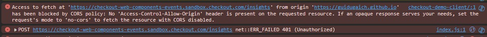

# Checkout T-shirt Store

[React](https://react.dev/) + [Vite](https://vitejs.dev/) + Typescript website built for the Checkout.com assignment

## Environment Variables

The project need a couple of env vars to run. Copy the `.env.exemple` file to create the `.env`. 

## Getting Started

Clone the repository and run `npm install`. Use a node version higher than 18 to avoid package incompatibility.

`npm run dev` to run locally and serve to `http://localhost:5173/`.

## Deployment

Project is deployed to Github Pages and can be found at https://guidugaich.github.io/checkout-demo-client/

## Checkout

In this fake t-shirt store, you can select some of the products, their quantities and then do the checkout for payment.

* Both the checkout buttons might have a 60-90 second delay on the first try due to the cold start of the server deployed on [render](https://render.com). The subsequent requests should perform normally.

The *Checkout* button renders a [payment component](https://www.checkout.com/docs/payments/accept-payments/accept-a-payment-on-your-website-with-payment-components) the is supposed to capture card data and/or allow to pay with Google Pay. However, the card option is not working, since it doesn't let the user type the card number. I suspect the issue is realted to a call to the server made by the component to the https://checkout-web-components-events.sandbox.checkout.com/insights endpoint, which is being blocked by CORS policy on the front-end. The issue happens both locally and in the 'prod' environment (hosted on github pages) Evidence below

The *Checkout with Hosted Page* button leads the user to an [external page](https://www.checkout.com/docs/payments/accept-payments/accept-a-payment-on-a-hosted-page), where they have the option to actually complete the card payments or choose google pay, for android users. The user should be redirected to a success/failure page after the payment is completed. For users who choose the Germany country option, the "Sofort" option will appear as well.